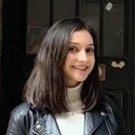
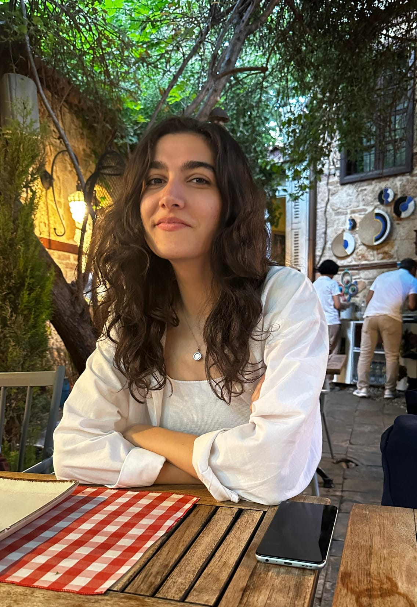
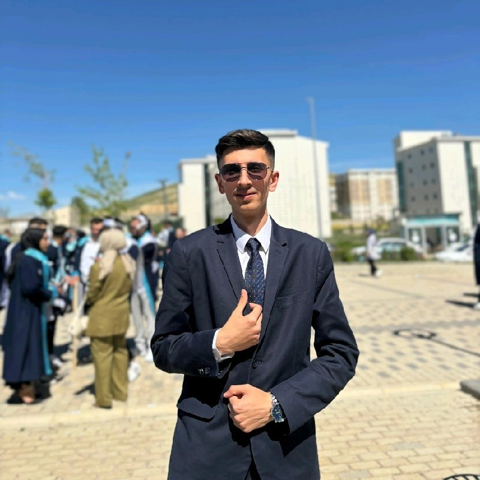

<!Oyun Logosu Koyulacak!>

# Information About Team and Product

## Team Members

  <table>
    <tr>
      <th></th>
      <th>Name & Surname</th>
      <th>Title</th>
      <th>Communication</th>
    </tr>
    <tr>
      <td></td>
      <td>Sara Nur KAY</td>
      <td>Scrum Master - Developer</td>
      <td>
        
        
        
      </td>
    </tr>
    <tr>
      <td></td>
      <td>Oğuzhan YELGEN</td>
      <td>Product Owner - Designer</td>
      <td>
        
      </td>
    </tr>
    <tr>
      <td></td>
      <td>Seda Naz DOLU</td>
      <td>Developer</td>
      <td>
        
      </td>
    </tr>
    <tr>
      <td></td>
      <td>Rabia Yaren BALIKÇIOĞLU</td>
      <td>Developer - Designer</td>
      <td>
        
        
      </td>
    </tr>
    <tr>
      <td></td>
      <td>Muhammet Talha GÜNCAN</td>
      <td>Developer - Designer</td>
      <td>
        
      </td>
    </tr>
  </table>

## Backlog Url 

## Product Details

### Product Description

    
<h3>Genel Bilgiler</h3>

    
<strong>Oyun Adı:</strong> <em>Yggateway</em>

    
<strong>Tür:</strong> <em>3D Aksiyon Macera</em>

    
<strong>Çok Oyunculu:</strong> <em>Evet</em>

    
<strong>Platform:</strong> <em>Mobile & PC</em>

    
<strong>Oyun Geliştirme Takımı:</strong> <em>Unity Team 106, Google OUA tarafından 2023-2024 Bootcamp için oluşturuldu.</em>

    
<h3>Oynanış</h3>

    

        
<strong>Temel Oynanış</strong>

        
Oyuncular, Yggdrasil ağacının üç ana kökünden dokuz farklı mekana açılan portallar aracılığıyla çeşitli haritalarda görevler tamamlarlar. Her harita, benzersiz temalara ve zorluklara sahiptir.

    

    

        
<strong>Haritalar</strong>

        <ul>
            <li><strong>Asgard:</strong> <em>Tanrıların ikamet ettiği dünya.</em></li>
            <li><strong>Midgard:</strong> <em>İnsanların yaşadığı dünya.</em></li>
            <li><strong>Alfheim:</strong> <em>Işık elflerinin diyarı.</em></li>
            <li><strong>Svartalfheim:</strong> <em>Karanlık elflerinin diyarı.</em></li>
            <li><strong>Jotunheim:</strong> <em>Devlerin diyarı.</em></li>
            <li><strong>Muspelheim:</strong> <em>Ateş diyarı.</em></li>
            <li><strong>Niflheim:</strong> <em>Buz diyarı.</em></li>
            <li><strong>Helheim:</strong> <em>Ölülerin diyarı.</em></li>
            <li><strong>Vanaheim:</strong> <em>Vanir tanrılarının diyarı.</em></li>
        </ul>
    

    

        
<strong>Görevler</strong>

        <ul>
            <li><strong>Bulmaca Çözme:</strong> <em>Oyuncular, oyun içerisinde çeşitli bulmacaları çözmek zorundadırlar. Bu bulmacalar, her haritanın temasına uygun şekilde farklı zorluklarda tasarlanmıştır.</em></li>
            <li><strong>Malzeme Toplama:</strong> <em>Oyuncular, her haritanın temasına uygun belirli malzemeleri toplamak zorundadır. Malzemeleri toplama görevlerinin amacı ve detayları haritaya göre değişiklik gösterir.</em></li>
            <li><strong>Savaş:</strong> <em>Belirli haritalardaki bazı görevler düşmanlarla savaşmayı ve onları yenmeyi gerektirir. Oyuncular, bu savaşlarda yeteneklerini ve stratejilerini kullanarak düşmanları alt etmek zorundadır.</em></li>
        </ul>
    

    

        
<strong>Zaman Sınırı</strong>

        
<em>Oyunun tamamı 20 dakikalık bir süre içermektedir. Oyuncular, tüm görevleri bu süre içerisinde tamamlamak zorundadırlar.</em>

    

    
<h3>Hikaye</h3>

    
<em>Yakın bir gelecekte, dünya yok olmanın eşiğine gelmiştir. İklim değişiklikleri, doğal afetler ve insanlık tarafından yapılan yıkımlar, gezegenimizi kurtarılamaz bir duruma getirmiştir. Ancak bir umut vardır. İnsanlık, tarih öncesi zamanlardan ileri teknoloji dünyalarına kadar uzanan esrarengiz Yggdrasil’in gizemini keşfetmiştir. Yggdrasil, tüm evreni birbirine bağlayan devasa bir dünya ağacıdır. Bu ağacın üç ana kökü, kendi benzersiz dünyasına açılan kapılarla doludur. Yggdrasil ağacının gizemli portalları ile dünyanın dört bir yanında zamanın ve mekanın sınırlarını zorlayarak tehlikeler ve gizemlerle dolu görevleri tamamlamak gezegenimizi kurtarabilecek cesur karakterlerin yolculuğunu mümkün kılmaktadır.</em>

    
<h3>Amaç</h3>

    
<em>Oyunun amacı, Yggdrasil’in dokuz farklı mekanında bulunan görevleri tamamlayarak dünyayı yok olmaktan kurtarmaktır. Oyuncular, her bir haritada bulunan tehlikelerle dolu görevleri çözmek ve portal geçişleriyle farklı mekanlara geçiş yaparak zamanın ve mekanın sınırlarını aşmak zorundadırlar. Görevlerin tamamlanmasındaki temel hedef, 20 dakika içerisinde tüm görevleri bitirerek dünyayı kurtarmaktır. Bu zorlu yolculukta oyuncular, cesaretlerini, zekalarını ve becerilerini kullanarak insanlığın son umudu olacaklardır.</em>

    
<h3>Teknik Özellikler</h3>

    
Unity oyun motoru kullanılarak C# programlama diliyle geliştirilmektedir.

    
<h3>Hedef Kitle</h3>

    
<strong>Yaş Grubu:</strong> <em>+7</em>

    
<strong>İlgi Alanları:</strong> <em>Eylem-macera oyunları, mitoloji ve çok oyunculu deneyimlere ilgi duyan oyuncular.</em>

    
<strong>Oynanış Tercihleri:</strong> <em>Mobil ve PC oyunları ile farklı ortamları keşfetmeyi, bulmaca çözmeyi, kaynak toplamayı ve savaşa katılmayı seven oyuncular için uygundur.</em>

    
<h2>Jüriye Not (Opsiyonel)</h2>

    
<em>Buraya jüriye iletmek istediğiniz notları ekle</em>

