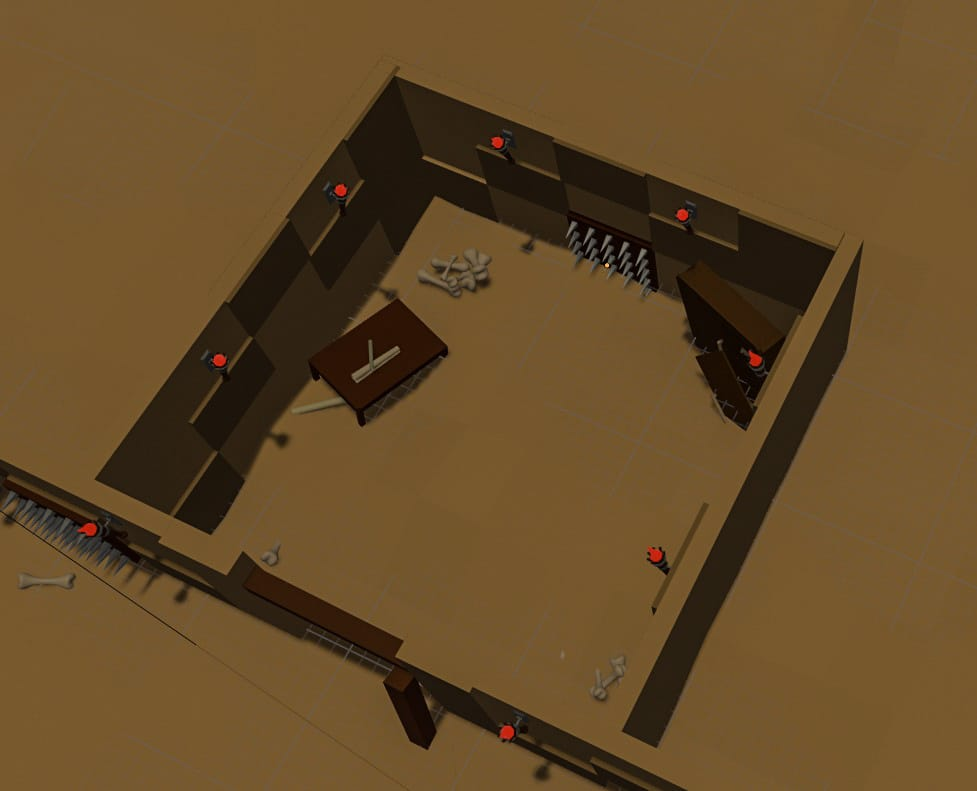
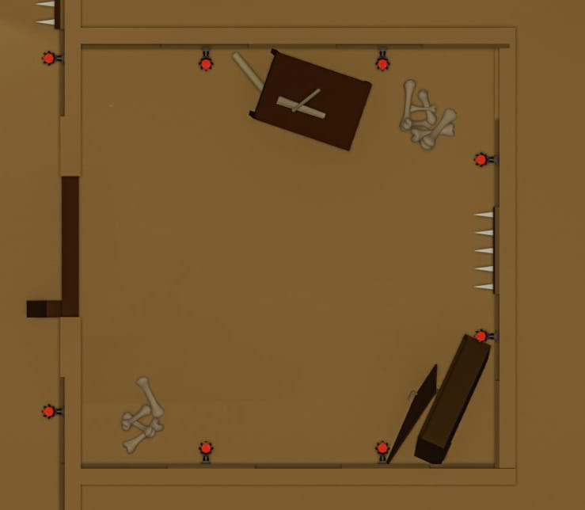
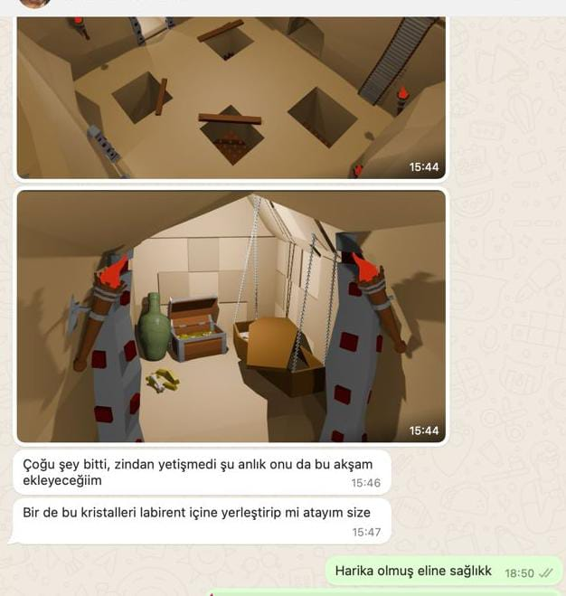

# Information About Team and Product

## Team Members

  <table>
    <tr>
      <th></th>
      <th>Name & Surname</th>
      <th>Title</th>
      <th>Communication</th>
    </tr>
    <tr>
      <td></td>
      <td>Sara Nur KAY</td>
      <td>Scrum Master - Developer</td>
      <td>
        
        
        
      </td>
    </tr>
    <tr>
      <td></td>
      <td>Oğuzhan YELGEN</td>
      <td>Product Owner - Designer</td>
      <td>
        
      </td>
    </tr>
    <tr>
      <td></td>
      <td>Seda Naz DOLU</td>
      <td>Developer</td>
      <td>
        
      </td>
    </tr>
    <tr>
      <td></td>
      <td>Rabia Yaren BALIKÇIOĞLU</td>
      <td>Developer - Designer</td>
      <td>
        
        
      </td>
    </tr>
    <tr>
      <td></td>
      <td>Muhammet Talha GÜNCAN</td>
      <td>Developer - Designer</td>
      <td>
        
      </td>
    </tr>
  </table>

## Product Details

<h2>Product Description</h2>

        

            
<h3>General Information</h3>

            
<strong>Game Name:</strong> <em>Yggateway</em>

            
<strong>Genre:</strong> <em>3D Action Adventure</em>

            
<strong>Multiplayer:</strong> <em>Yes</em>

            
<strong>Platform:</strong> <em>Mobile & PC</em>

            
<strong>Game Development Team:</strong> <em>Unity Team 106, created by Google OUA for the 2023-2024 Bootcamp.</em>

             
            
<strong>Story:</strong> <em>In the near future, the world is on the brink of destruction. Climate changes, natural disasters, and man-made devastations have brought our planet to an irreparable state. However, there is hope. Humanity has discovered the mystery of the enigmatic Yggdrasil, which spans from prehistoric times to advanced technological worlds. Yggdrasil is a massive world tree that connects the entire universe. This tree's three main roots are filled with doors leading to their unique worlds. By using the mysterious portals of the Yggdrasil tree, courageous characters can embark on journeys full of dangers and mysteries, breaking the boundaries of time and space to complete tasks that could save our planet.</em>

             
            
<strong>Objective:</strong> <em>The aim of the game is to save the world from destruction by completing tasks located in nine different realms of Yggdrasil. Players must solve perilous tasks in each map and traverse different realms through portals, breaking the boundaries of time and space. The primary goal is to complete all tasks within 20 minutes to save the world. In this challenging journey, players will use their courage, intelligence, and skills to become humanity's last hope.</em>

    

            
<h3>Gameplay</h3>

            

                
<strong>Basic Gameplay</strong>

                
<em>Players complete tasks on various maps through portals that lead to nine different realms from the three main roots of the Yggdrasil tree. Each map has unique themes and challenges.</em>

            

                
<strong>Maps</strong>

                <ul>
                    <li><strong>Asgard:</strong> <em>The world where the gods reside.</em></li>
                    <li><strong>Midgard:</strong> <em>The world where humans live.</em></li>
                    <li><strong>Alfheim:</strong> <em>The realm of the light elves.</em></li>
                    <li><strong>Svartalfheim:</strong> <em>The realm of the dark elves.</em></li>
                    <li><strong>Jotunheim:</strong> <em>The realm of the giants.</em></li>
                    <li><strong>Muspelheim:</strong> <em>The realm of fire.</em></li>
                    <li><strong>Niflheim:</strong> <em>The realm of ice.</em></li>
                    <li><strong>Helheim:</strong> <em>The realm of the dead.</em></li>
                    <li><strong>Vanaheim:</strong> <em>The realm of the Vanir gods.</em></li>
                </ul>

            

                
<strong>Tasks</strong>

                <ul>
                    <li><strong>Puzzle Solving:</strong> <em>Players must solve various puzzles within the game. These puzzles are designed with varying difficulties according to the theme of each map.</em></li>
                     
                    <li><strong>Gathering Materials:</strong> <em>Players must collect certain materials appropriate to the theme of each map. The purpose and details of these gathering tasks vary according to the map.</em></li>
                     
                    <li><strong>Combat:</strong> <em>Some tasks on specific maps require fighting enemies and defeating them. Players must use their skills and strategies in these battles to overcome the enemies.</em></li>
                </ul>

            

                
<strong>Time Limit</strong>

                
<em>The entire game has a duration of 20 minutes. Players must complete all tasks within this time frame.</em>

    

        
Technical Specifications

        
<em>The game is being developed using the Unity game engine with the C# programming language.</em>

    

    

        
Note to Jury

        
<em>Dear Jury Members,</em>

        
<em>Our game Yggateway, developed by Unity Team 106, aims to blend legendary mythology with modern science fiction to provide gamers with a unique experience. Players             journey through nine different realms of the Yggdrasil tree via portals, each realm presenting different themes and challenges such as puzzle-solving and resource gathering.</em>

        
<em>Set in a near future where the world is on the brink of destruction, our game's concept aims to highlight the Sustainable Development Goals planned to be achieved by 2030. Through tasks that blend mythology and modernity, the game also aims to raise awareness about the Sustainable Development Goals. The time limit we have set to complete tasks within the game reflects the urgency in our real-world mission to tackle these goals with the limited time we have.</em>

# Sprints

    
<h2>Sprint 1</h2>

    
<strong>Estimated Completion Points:</strong> <em>The points estimated to be completed within the sprint are set at 99.</em>

     
    
<strong>Point Completion Logic:</strong> <em>We based our sprint point estimation on the Fibonacci sequence. This method helped us to more accurately evaluate the complexity and time consumption of the tasks. The Fibonacci sequence assisted us in determining the difficulty level of each task. This point system generally assigns higher points to more complex tasks and lower points to simpler tasks, ensuring that the team progresses with the correct priorities throughout the sprint.</em>

     
    
<strong>Daily Scrum:</strong> <em>Through regular meetings held on Discord and WhatsApp, we effectively maintained team communication. These meetings, scheduled considering the different availabilities of team members, allowed the sharing of daily progress, discussion of encountered problems, and planning of the next steps. In each meeting, we assessed the progress made during the sprint and strengthened our coordination to achieve our goals.</em>

     
    
<a href="https://trello.com/b/cOckJ1er/bootcamp-u106-1st-sprint" target="_blank">Backlog Trello URL</a>

     
    
     
    
     
    
     
    
<strong>WhatsApp & Discord Screenshots</strong>

    
     
    
     
    
     
    
<strong>Product Status:</strong>

    
     
    
     
    
    
<strong>Sprint Review:</strong>

    
<em>In this sprint, we laid a solid foundation for the Yggateway game. We completed the backlog points of 99 as planned. We started the 3D design of the first map and determined the name and story of the game. Additionally, we created the basic logo design but plan to update it in future sprints. We strengthened team communication by holding regular meetings on Discord and WhatsApp. Through daily Scrum meetings, we tracked our progress and came together to solve issues. For future sprints, we decided to have the design and development teams progress concurrently. Believing that design will play a critical role in the development of the game, we distributed tasks among the design team. By evaluating our successes and forward plans during this process, we identified improvements and strategies to achieve our goals in the next stages of the game.</em>

    
<strong>Sprint Review Participants:</strong> <em>Sara Nur KAY, Rabia Yaren BALIKÇIOĞLU, Seda Naz DOLU, Muhammet Talha GÜNCAN, Oğuzhan YELGEN.</em>

    
<strong>Sprint Retrospective:</strong>

    <ul>
    <li>
What Went Well?
</li>
    
<em>
    - We finalized the core design of the game and started the detailed design of the first map.
    </em>

    
<em>
    - We made clear decisions on the name and story of the game.
    </em>

    
<em>
    - We conducted daily Scrum meetings via WhatsApp.
    </em>

    <li>
What Can Be Improved?
</li>
    
<em>
    - We need to iterate more on the logo design to achieve a better result.
    </em>

    
<em>
    - We need to find more effective solutions to overcome obstacles encountered during the coding process.
    </em>

    <li>
Suggestions and Improvement Paths
</li>
    
<em>
    - We plan to allocate more time for logo design in future sprints.
    </em>

    
<em>
    - In future sprints, we should set clearer and more measurable goals for map design and coding. Starting from the second sprint, the design and development teams will work concurrently.
    </em>

    <li>
Action Plan
</li>
    
<em>
    - By revising the resources and timing required for the first map design, we aim to start it in the second sprint.
    </em>

    
<em>
    - We will establish a more rigorous planning process between the design team and the development team to accelerate the coding process.
    </em>

    </ul>

  
<h2>Sprint 2</h2>

  
<strong>Estimated Completion Points:</strong> <em>The points estimated to be completed within the sprint are set at 58.</em>

     
  
<strong>Point Completion Logic:</strong> <em>We based our sprint point estimation on the Fibonacci sequence. This method helped us to more accurately evaluate the complexity and time consumption of the tasks.</em>

   
  
<strong>Daily Scrum:</strong> <em>We effectively maintained team communication through meetings held on Discord and WhatsApp. However, we faced difficulties in communicating with some team members in this setup.</em>

     
    
<a href="https://trello.com/b/kxFTaJRi/bootcamp-u106-2nd-sprint" target="_blank">Backlog Trello URL</a>

     
    
     
    
<strong>WhatsApp Screenshots</strong>

    
     
    
     
    
     
    
<strong>Product Status:</strong>

    
     
    
     
    

<strong>Sprint Review:</strong>

<em>In this sprint, we did not achieve some of our goals. We aimed to complete 58 backlog points in our sprint plans, but due to team members' personal lives, they had difficulty maintaining active communication with the team and meeting deadlines. Based on our sprint evaluation, we decided to have detailed discussions with members individually to determine whether they will continue with the team collaboration.</em>

    
<strong>Sprint Review Participants:</strong> <em>Sara Nur KAY, Rabia Yaren BALIKÇIOĞLU, Seda Naz DOLU, Muhammet Talha GÜNCAN, Oğuzhan YELGEN.</em>

    
<strong>Sprint Retrospective:</strong>

    <ul>
    <li>
What Went Well?
</li>
    
<em>
    - The details of our first map were designed to be aesthetically pleasing.
    </em>

    
<em>
    - We made clear decisions on the name and story of the game.
    </em>

    
<em>
    - We started writing the basic draft code.
    </em>

    <li>
What Can Be Improved?
</li>
    
<em>
    - We need to find solutions that will improve and speed up the design and coding processes.
    </em>

    
<em>
    - We can have one-on-one discussions with team members to gather information about their tasks related to the process and ask whether they will continue.
    </em>

    <li>
Action Plan
</li>
    
<em>
    - By reviewing the resources and time required to complete the first map design, we aim to start it in the third sprint.
    </em>

    
<em>
    - We aim to finish writing the initial draft code and make the game code more functional.
    </em>

      
<em>
    - By having one-on-one discussions with team members, we aim to reassign tasks and complete any unfinished tasks if they decide not to continue with the process.
    </em>

    </ul>

